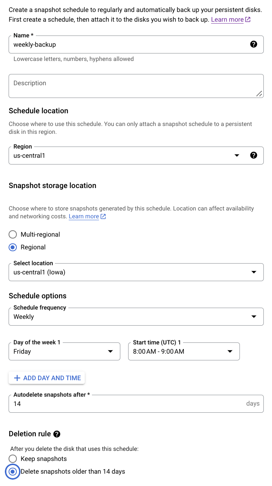
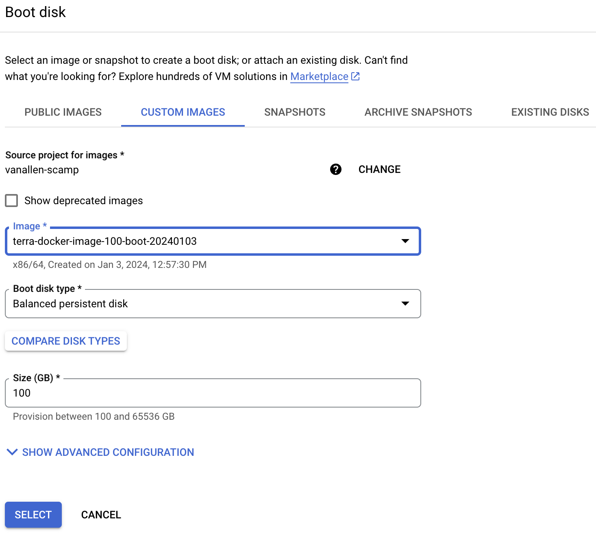
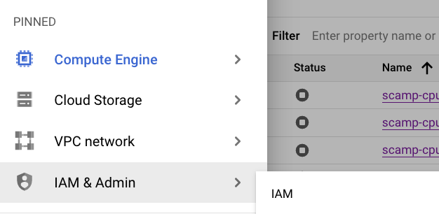
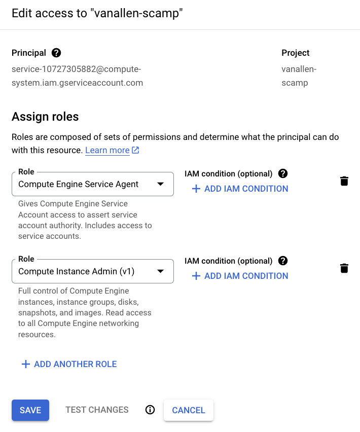
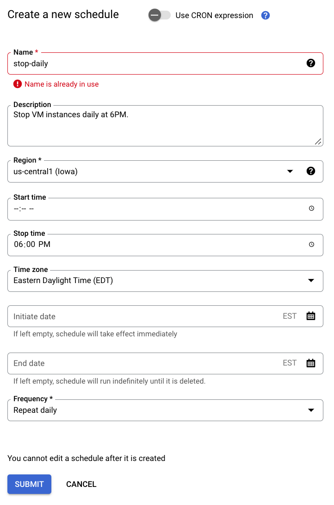

# Introduction to GCP VMs and using Terra notebook environments

Recently in the lab, our two main avenues for performing primarily notebook-based analyses with high compute resources have either stopped being maintained (broad server) or come with a lot of headaches (Terra). 

IMO, a promising solution to the above is to strip away the Terra UI and notebook management service, only using the underlying GCP VMs and disks to utilize jupyter notebooks. 

## Creating a virtual machine and persistent disk
1. Creating a VM instance and attaching a persistent disk through the GCP UI
	1. Ask Brendan and Erin to create a google cloud project for you (e.g. `vanallen-scamp` is mine). You will receive an email to accept the project invitation where you will click the link provided. Then, the project should show up when you navigate to the [Google Cloud Console](https://console.cloud.google.com/ ) and log in. <br><br>   <br><br>
	2. <a name="snapshot"></a> Create a schedule to automatically back-up your data. Navigate to `Snapshots`, then select the `Snapshot schedules` tab. An option at the top of the webpage should be `Create a snapshot schedule`, select that option. I have created a weekly backup, where backups 2+ weeks old will be deleted. You can customize this to your liking. Backups created will be visible in this `Snapshots` tab. <br><br>
	   <br>
	4. Navigate to `Compute Engine` -> `VM instances` tab. Select `Create an instance`. 
		1. General lab guidelines for VM naming can be found in our [GCP Handbook - Non-Terra](https://docs.google.com/document/d/1QYqFy7rCAAmsRMfkMtYUPAHyM-FKONMHOq4nD4Tpji0/edit)
			1. Here, I named mine `scamp-cpu-16` encoding that the VM is using CPUs not GPUs and has 16 GB of memory.
		2. Set region to `us-central1 (Iowa)`
		3. I've been keeping most options as the default. I've been choosing from the Standard machine types. <br> <br><br>
		4. Ask Sabrina to [give you access to her project](https://cloud.google.com/deployment-manager/docs/configuration/using-images-from-other-projects-for-vm-instances#console) and change the boot disk to be from the Custom Image named `terra-docker-image-100-boot-20240103`. To be able to see this image, you have to select `vanallen-scamp` under the "Source projects for images" section. This boot disk already has Docker installed and the following three Terra notebook environments are cached: 
		   - **R/Bioconductor**: us.gcr.io/broad-dsp-gcr-public/terra-jupyter-bioconductor:2.2.4
		   - **Python**: us.gcr.io/broad-dsp-gcr-public/terra-jupyter-python:1.1.5
		   - **Default**: us.gcr.io/broad-dsp-gcr-public/terra-jupyter-gatk:2.3.6
		   
			These images are using R version 4.3.2 and Python version 3.10.12.<br><br> <br>
		2. If you don't already have a persistent disk created, you can create and attach a disk at this time in the `Advanced options` section. These operate the same as Terra PDs, where if you delete the VM the persistent disk will remain. 
			1. Here I've named mine `scamp-singlecell` to indicate which project's data will be stored here.
			2. Select the [snapshot schedule](#snapshot) you created to create automatic back-ups for this disk.
1. Create an [instance schedule](https://cloud.google.com/compute/docs/instances/schedule-instance-start-stop) for automatic daily shut down of your VM instance. <br>
   Terra notebooks had a nice feature of auto-pausing your VM when it was inactive for a set amount of time. This reduced our overall costs of using VMs because we didn't have to worry about forgetting to turn off our VM. This functionality does not exist when using GCP VMs outside of Terra. However, they do have instance schedules, which allow you to program a start and/or stop time to your VM(s). 
	1. First, set appropriate permissions to your service account to be able to create an instance schedule. On the google cloud site, navigate to the "IAM & Admin" tab -> select the "IAM" option. <br> <br> <br>
	2. Check the box in the upper right corner to "Include Google-provided role grants", to display all service accounts associated with your project. For the email address with the naming convention `service-{sequence of numbers}@compute-system.iam.gserviceaccount.com`, click the pencil to the right hand side of the row to edit. 
	3. Add the role `Compute Instance Admin (v1)` to this service account, and save. <br><br> <br>
	4. Navigate back to the `Compute Engine` -> `VM instances` tab. At the top of the page, click the `Instance schedules` tab, then select `Create schedule`. 
	5. Create a schedule that makes sense for when you typically stop working for the day.<br><br> <br>
	6. Click on the name of the created schedule, and add your VM instance(s) to it. If one day you want to work later, remove your instance from the schedule (and add it back later!). 
1. If you haven't already, install [Google Cloud SDK](https://cloud.google.com/sdk/) and have run `gcloud auth login` in your terminal.
2. Set up port forwarding and start an interactive VM session from your local terminal. 
	1. Clone this repository
		```bash
		git clone https://github.com/sabrinacamp2/Non-Terra-GCP.git
		```
	1. Navigate to the `Non-Terra-GCP/VM-helper-scripts` directory. Open `config.sh` in a text editor or command-line text editor. Edit variables to match the instance name and project that is specific to you. My information is set as an example.
		```bash
		cd Non-Terra-GCP/VM-helper-scripts
		vim `config.sh`
		```
	1. Run bash script that will set up port forwarding in the background and start an interactive VM session. After running this command your terminal prompt should change to `> {username}@{instance-name}`<a name="start-vm"></a>
		```bash
		./start_vm.sh
		```

3. Format the attached persistent disk <br> **You only have to do this once to a disk. It will wipe your disk clean if you do it again once you have data stored on it**
	1. Find the name of the persistent disk you created using the following command: <br>
	   ```bash
	   ls /dev/disk/by-id/
	   ```
	    Note down the name of the disk. 
	2. [Format the persistent disk](https://cloud.google.com/compute/docs/disks/format-mount-disk-linux) using the following command: 
		```bash
		sudo mkfs.ext4 -m 0 -E lazy_itable_init=0,lazy_journal_init=0,discard /dev/disk/by-id/{persistent-disk-name}
		```
		
		```bash
		#example
		sudo mkfs.ext4 -m 0 -E lazy_itable_init=0,lazy_journal_init=0,discard /dev/disk/by-id/scsi-0Google_PersistentDisk_scamp-singlecell
		```
1. Mount the formatted and attached disk
	1. Create a folder to mount the disk to (specific naming up to you) <a name="mount-folder"></a>
		```bash
		sudo mkdir /mnt/disks
		sudo mkdir /mnt/disks/{folder-name}
		```
		
		```bash
		#example
		sudo mkdir /mnt/disks
		sudo mkdir /mnt/disks/scamp-singlecell
		```
	1. Mount disk to folder location <a name="mount"></a>
		```bash
		sudo mount -o discard,defaults /dev/disk/by-id/{persistent-disk-name} /mnt/disks/{folder-name}
		```
		
		```bash
		#example
		sudo mount -o discard,defaults /dev/disk/by-id/scsi-0Google_PersistentDisk_scamp-singlecell /mnt/disks/scamp-singlecell
		```
	1. Set read and write permissions for the disk
		```bash
		sudo chmod a+w /mnt/disks/{folder-name}
		```
		
		```bash
		#example 
		sudo chmod a+w /mnt/disks/scamp-singlecell
	   ```

## Running a Terra notebook environment in a GCP VM

The [ready-to-go Terra notebook environments](https://github.com/DataBiosphere/terra-docker/tree/master) have a lot of upsides. They already have google cloud, git, python, R, pip, conda, jupyter, FISS, and several major python/R packages installed (depending on which environment you choose). Utilizing these environments allows you to swap between pretty different "package universes" (e.g. R/Bioconductor vs python) without installing anything yourself. If you have used the broad server, this is similar to being able to use and unuse a dotkit, except the dotkit here is 10s-100s of packages. 

Only the notebooks, plots, packages, data that **you create/install** will be saved on the persistent disk and be available for you to access no matter what environment you plug and play with. The persistent disk will not be deleted and you can use this with different VMs (e.g. if you needed more memory). However, everything that comes with the Terra notebook environment is not saved to your persistent disk. 

For example, let's say you are using the R/Bioconductor Terra notebook environment that has Seurat installed. If you then switch to using the python environment, you would not be able to access the Seurat package. However, if when using the R/Bioconductor Terra notebook environment _you_ installed Seurat, when you switch to the python environment you would be able to access Seurat because the package install location was on the persistent disk. 

Terra has some good documentation on boot and persistent disks [here](https://support.terra.bio/hc/en-us/articles/360047318551-Detachable-Persistent-Disks-) and [here](https://support.terra.bio/hc/en-us/articles/360027237871-Terra-s-Jupyter-Notebooks-environment-Part-I-Key-components#h_aa3e9486-5d2d-470b-89f4-0dbc4301829e)

In this tutorial, I show how you can use the Terra notebook environments in a GCP VM. This allows us to use these nifty environments without having to interface with the Terra UI. 

1. Set persistent disk permissions so that docker can read/write to it.
   - We also need to set the appropriate permissions for our persistent disk prior to running the Terra docker so that when we enter the docker and mount our persistent disk the docker user can read/write to it. The idea is more fully explored in this [stackoverflow post](https://stackoverflow.com/questions/29245216/write-in-shared-volumes-docker). <a name="docker-read"> </a>
		```bash
		sudo chown -R 1000:100 /mnt/disks/{folder-name}
		```
		
		```bash
		#example
		sudo chown -R 1000:100 /mnt/disks/scamp-singlecell
		```
1. Run the Terra docker of choice. <a name="terra-docker"></a>
   - Example command below using one of the cached Terra docker images. 
		```bash
		sudo docker run -e R_LIBS='/home/jupyter/packages' --rm -it -u jupyter -p 8080:8080 -v /mnt/disks/{folder-name}:/home/jupyter --entrypoint /bin/bash {terra-docker-image-path}
		```
		
		```bash
		#example
		sudo docker run -e R_LIBS='/home/jupyter/packages' --rm -it -u jupyter -p 8080:8080 -v /mnt/disks/scamp-singlecell:/home/jupyter --entrypoint /bin/bash us.gcr.io/broad-dsp-gcr-public/terra-jupyter-bioconductor:2.1.11
		```
	- To explain some of this command, we are specifying that we want to interactively run the docker container as the non-root `jupyter` user (this is how its done in Terra notebooks). We specify to place user-installed R packages into the `/home/jupyter/packages` location. We perform port mapping `8080:8080` so that we can access the services running inside the docker. We are mounting our persistent disk to the `/home/jupyer` location inside of the docker. This means when you are inside of the docker, ONLY the things saved in the `/home/jupyter` path will be saved to the persistent disk. Everything else will not be saved. (You really don't need to worry about this, the $HOME dir is /home/jupyter so by default things will be installed/saved here). When you exit the docker, navigate to `/mnt/disks/{folder-name}` to access what you put in `/home/jupyter` when you were inside of the docker. 
	- Terra docker images not cached on the boot disk (those cached listed [here](Supplementary-information.md#How-the-boot-disk-image-used-in-this-tutorial-was-created)) **can still be used here**, but the `docker run` command will take significantly longer. This is because it is pulling the docker from scratch. If you don't plan on using any of the cached images, I would recommend creating a new boot disk image to use with your VMs that have the environments you want, instructions [here](Supplementary-information.md#newboot).
1. Set up gcloud authentication. <a name="gcloudauth"></a>
   - With newer versions of gcloud, it's no longer possible to authenticate on a machine that doesn't have a web browser (like the GCP VM). The new Instructions below for authenticating a machine without a web browser is from the [google cloud SDK documentation](https://cloud.google.com/sdk/docs/authorizing#auth-login) You _should_ only have to do this once, because the credentials are stored on the persistent disk and could be used with any VM. _I think?_
		1. Once inside Terra docker, run the following command in the GCP VM:
		   ```bash
		   gcloud auth login --no-browser
			```
		2. Copy the long command that begins with `gcloud auth login --remote-bootstrap="`
		3. Paste and run this command on the command line of a different terminal (e.g. your local terminal) that has gcloud installed
		4. Copy the long URL output from the alternative terminal and paste it back to the first machine terminal. Press enter. You should now be authenticated. 
1. Transfer Terra persistent disk data to GCP persistent disk
	- Before performing these steps, I would recommend doing your best to clean up your Terra PD, deleting what you no longer need. Similar to cleaning before you move apartments, there is no need to bring junk to a new place! 

	1. Make a complete copy of your Terra PD to a google bucket. The google bucket folder (here, `notebook-cache-{date}`) should *not* already exist in your bucket for everything to copy in the right directory structure. This folder will be automatically created by the `gsutil cp` process.  Navigate to the **Terra notebook associated terminal** and run the below command.
		```bash
		gsutil -m cp -r -L "terraPD_to_gbucket_{date}.log" /home/jupyter gs://{google-bucket}/notebook-cache-{date}
		```
		
		```bash
		#example
		e.g. gsutil -m cp -r -L "terraPD_to_gbucket_20230724.log" /home/jupyter gs://fc-3a463b92-98d9-47e3-9d16-4ba001069ee9/notebook-cache-20230724
		```
		
		- This will not copy over conda environments. Consider exporting environments to .yml files for easy rebuild on GCP VM. 
		- [Optional] Check if any files were not successfully transferred by inspecting `filtered_output.csv`
		  ```bash
		  grep -v "OK" terraPD_to_gbucket_{date}.log > filtered_output.csv
		  ```
	1. Copy google bucket folder contents to GCP PD 
		1.  [Run Terra docker of choice](#terra-docker), if not already in the docker.
		2. Copy Terra PD contents from google bucket to GCP PD
			```bash
			gsutil -m cp -r -L "gbucket_to_gcpPD_{date}.log" gs://{google-bucket}/notebook-cache-{date}/* /home/jupyter/
			```
			
			```bash
			#example
			gsutil -m cp -r -L "gbucket_to_gcpPD_20230724.log" gs://fc-3a463b92-98d9-47e3-9d16-4ba001069ee9/notebook-cache-20230724/* /home/jupyter/
			```
	2. Repeat [google cloud authorization steps](#gcloudauth). We have seen that config files transferred from the Terra PD break the authorization we just set up.
1. Conda environments
	1. By default, conda environments are placed in `/opt/conda/envs`. As I mentioned earlier, only files in `/home/jupyter` will be saved to the persistent disk, so by default the created conda environments **would be lost** if you created a new VM. To keep your conda environments, edit the conda configuration to save the environments to a location that is on the persistent disk. 
		```bash
		conda config --append envs_dirs /home/jupyter/envs
		```
1. [Option one, Sabrina preferred] Jupyter lab
	1. Create the jupyter lab configuration and password. 
	   - See below.
		   ```bash
		   jupyter-lab --generate-config
		   # set password
		   jupyter-lab password
			```
	1. Edit jupyter lab configuration to let us run the notebook in our browser.
	   - Use whatever text editor you want. Example below. 
		   ```bash
		   vim /home/jupyter/.jupyter/jupyter_lab_config.py
			```
		- Carefully copy the below lines to the top of the config file. We have seen issues with copy + pasting before, so proceed with caution! If you get nervous that you have messed up the config file beyond repair (unlikely), you can regenerate the file via `jupyter-lab --generate-config` and try to edit it again. 
			```
			c = get_config()
			c.NotebookApp.ip = '0.0.0.0'
			c.NotebookApp.open_browser = False
			c.NotebookApp.port = 8080
			```
		
			
	1. Run jupyter lab.
	   - Below command.
		   ```bash
		   jupyter-lab --no-browser
			```
	1. Navigate to jupyter lab in your browser of choice. 
	   - The address you are going to navigate to will be the following, `localhost:8080`
	   
1. [Option two] Jupyter notebook
	1. Create the jupyter notebook configuration and password. 
	   - Loosely following [this tutorial](https://towardsdatascience.com/running-jupyter-notebook-in-google-cloud-platform-in-15-min-61e16da34d52). 
		   ```bash
		   jupyter notebook --generate-config
		   # set password
		   jupyter notebook password
			```
	1. Edit jupyter notebook configuration to let us run the notebook in our browser.
	   - Use whatever text editor you want. Example below. 
		   ```bash
		   vim /home/jupyter/.jupyter/jupyter_notebook_config.py
			```
		- Paste the following lines to the top of the file and save. 
			```
			c = get_config()
			c.NotebookApp.ip = '0.0.0.0'
			c.NotebookApp.open_browser = False
			c.NotebookApp.port = 8080
			```
		
			
	1. Run jupyter notebook.
	   - Below command.
		   ```bash
		   jupyter notebook --no-browser
			```
	1. Navigate to the jupyter notebook in your browser of choice. 
	   - The address you are going to navigate to will be the following, `localhost:8080`


# Quick start
## I stopped my VM and restarted it. What all do I have to do to get jupyter up and running again? <a name="quickstart"></a>
1. [Start port forwarding and an interactive VM session](#start-vm)
2. [Mount persistent disk to VM](#mount)
3. [Run Terra docker of choice](#terra-docker)
4. Run jupyter notebook or jupyter lab
	1. e.g. `jupyter notebook --no-browser` or `jupyter-lab --no-browser`
5. Go to `localhost:8080` in a web browser
<br>

For example, copy the below code chunks and paste into the terminal.

**In local terminal**
```bash
# navigate to cloned repository directory
cd Non-Terra-GCP/VM-helper-scripts

# start port forwarding and interactive VM session
./start_vm.sh
```
**Once in GCP VM**
```bash
# start screen on VM for your jupyter notebook process
screen -S jupyter_notebook

# mount persistent disk
sudo mount -o discard,defaults /dev/disk/by-id/{persistent-disk-name} /mnt/disks/{folder-name}

# start up terra notebook environment and jupyter notebook
sudo docker run -e R_LIBS='/home/jupyter/packages' --rm -it -u jupyter -p 8080:8080 -v /mnt/disks/{folder-name}:/home/jupyter --entrypoint /bin/bash {terra-docker-image-path}

jupyter-lab --no-browser --port=8080
```

<br>

## I created a new VM (e.g., needed more memory). What all do I have to do to get jupyter up and running again? 
1. [Start port forwarding and an interactive VM session](#start-vm)
2. [Create folder to mount persistent disk to](#mount-folder)
3. [Mount persistent disk to VM](#mount)
4. [Allow docker user to read/write to PD](#docker-read)
5. [Run Terra docker of choice](#terra-docker)
6. Run jupyter notebook or jupyter lab
	1. e.g. `jupyter notebook --no-browser` or `jupyter-lab --no-browser`
7. Go to `localhost:8080` in a web browser

<br>

For example, copy the below code chunks and paste into the terminal.
**In local terminal**
```bash
# navigate to cloned repository directory
cd Non-Terra-GCP/VM-helper-scripts

# start port forwarding and interactive VM session
./start_vm.sh
```
**Once in GCP VM**
```bash
# start screen on VM for your jupyter notebook process
screen -S jupyter_notebook

sudo mkdir /mnt/disks

sudo mkdir /mnt/disks/{folder-name}

sudo mount -o discard,defaults /dev/disk/by-id/{persistent-disk-name} /mnt/disks/{folder-name}

sudo chown -R 1000:100 /mnt/disks/{folder-name}

sudo docker run -e R_LIBS='/home/jupyter/packages' --rm -it -u jupyter -p 8080:8080 -v /mnt/disks/{folder-name}:/home/jupyter --entrypoint /bin/bash {terra-docker-image-path}

jupyter-lab --no-browser --port=8080
```