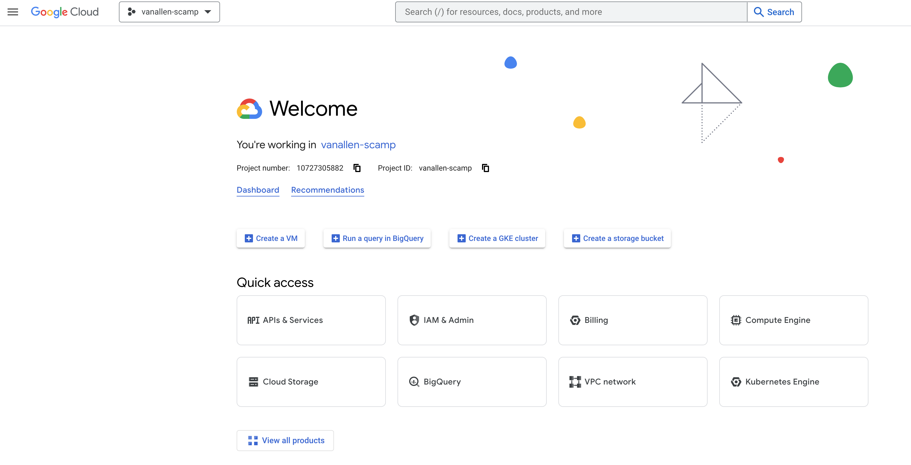

# Introduction to GCP VMs and using Terra notebook environments

Recently in the lab, our two main avenues for performing primarily notebook-based analyses with high compute resources have either stopped being maintained (broad server) or come with a lot of headaches (Terra). 

IMO, a promising solution to the above is to strip away the Terra UI and notebook management service, only using the underlying GCP VMs and disks to utilize jupyter notebooks. 

## Creating a virtual machine and persistent disk
1. Creating a VM instance and attaching a persistent disk through the GCP UI
	1. Ask Brendan and Erin to create a google cloud project for you (e.g. `vanallen-scamp` is mine). You will receive an email to accept the project invitation where you will click the link provided. Then, the project should show up when you navigate to the [Google Cloud Console](https://console.cloud.google.com/ ) and log in. <br><br>   <br><br>
	3. Navigate to `Compute Engine` -> `VM instances` tab. Select `Create an instance`. 
		1. General lab guidelines for VM naming can be found in our [GCP Handbook - Non-Terra](https://docs.google.com/document/d/1QYqFy7rCAAmsRMfkMtYUPAHyM-FKONMHOq4nD4Tpji0/edit)
			1. Here, I named mine `scamp-cpu-16` encoding that the VM is using CPUs not GPUs and has 16 GB of memory.
		2. Set region to `us-central1 (Iowa)`
		3. I've been keeping most options as the default. I've been choosing from the Standard machine types. <br> <br><br>
		4. Modify the firewall rules.
			1. Allow both HTTP and HTTPS traffic<br> 
		5. Ask Sabrina to [give you access to her project](https://cloud.google.com/deployment-manager/docs/configuration/using-images-from-other-projects-for-vm-instances#console) and change the boot disk to be from the Custom Image named `terra-docker-image-100-boot-20230720`. This boot disk already has Docker installed and the following three Terra notebook environments are cached: 
		   - **R/Bioconductor**: us.gcr.io/broad-dsp-gcr-public/terra-jupyter-bioconductor:2.1.11
		   - **Python**: us.gcr.io/broad-dsp-gcr-public/terra-jupyter-python:1.0.15
		   - **Default**: us.gcr.io/broad-dsp-gcr-public/terra-jupyter-gatk:2.2.14
			These images are using R version 4.3.0 and Python version 3.7.12.<br> 
		2. If you don't already have a persistent disk created, you can create and attach a disk at this time in the `Advanced options` section. These operate the same as Terra PDs, where if you delete the VM the persistent disk will remain. 
			1. Here I've named mine `scamp-singlecell` to indicate which project's data will be stored here.
			2. Consider creating a [snapshot schedule](supplementary-information.md#persistent-disk-snapshot-schedule) at this time for automatic data back up. 
		3. In the `Advanced options` -> `Networking` -> `Network inferfaces` section, click on the drop down arrow. In the `External IPv4 address` section, choose the option to "reserve static external IP address". Note down the IP address, it will be used for navigating to your jupyter notebook in the browser (e.g., http://33.245.66.245:8080)
		   - Note: Each static IP address costs money per hour. Navigate to `VPC network` -> `IP addresses` and release the static addresses not in use. 
1. SSH into the VM from your local terminal
	1. Set your default google cloud project to be the one Brendan and Erin assigned to you using the following command: 
		```bash
		gcloud config set project {project-id}
		```
		
		```bash
		#example
		gcloud config set project vanallen-scamp
		```
		   
	2. SSH into the VM instance using the following command: <a name="ssh"></a>
		```bash
		gcloud compute ssh --zone "us-central1-a" "{instance-name}" --project "{project-id}"
		```
		
		```bash
		#example
		gcloud compute ssh --zone "us-central1-a" "scamp-cpu-16" --project "vanallen-scamp"
		```

3. Format the attached persistent disk <br> ****You only have to do this once to a disk. It will wipe your disk clean if you do it again once you have data stored on it**
	1. Find the name of the persistent disk you created using the following command: <br>
	   ```bash
	   ls /dev/disk/by-id/
	   ```
	    Note down the name of the disk. 
	2. [Format the persistent disk](https://cloud.google.com/compute/docs/disks/format-mount-disk-linux) using the following command: 
		```bash
		sudo mkfs.ext4 -m 0 -E lazy_itable_init=0,lazy_journal_init=0,discard /dev/disk/by-id/{persistent-disk-name}
		```
		
		```bash
		#example
		sudo mkfs.ext4 -m 0 -E lazy_itable_init=0,lazy_journal_init=0,discard /dev/disk/by-id/scsi-0Google_PersistentDisk_scamp-singlecell
		```
1. Mount the formatted and attached disk
	1. Create a folder to mount the disk to (specific naming up to you) <a name=mount-folder </a>
		```bash
		sudo mkdir /mnt/disks
		sudo mkdir /mnt/disks/{folder-name}
		```
		
		```bash
		#example
		sudo mkdir /mnt/disks
		sudo mkdir /mnt/disks/scamp-singlecell
		```
	1. Mount disk to folder location <a name="mount" </a>
		```bash
		sudo mount -o discard,defaults /dev/disk/by-id/{persistent-disk-name} /mnt/disks/{folder-name}
		```
		
		```bash
		#example
		sudo mount -o discard,defaults /dev/disk/by-id/scsi-0Google_PersistentDisk_scamp-singlecell /mnt/disks/scamp-singlecell
		```
	1. Set read and write permissions for the disk
		```bash
		sudo chmod a+w /mnt/disks/{folder-name}
		```
		
		```bash
		#example 
		sudo chmod a+w /mnt/disks/scamp-singlecell
	   ```

## Running a Terra notebook environment in a GCP VM

The [ready-to-go Terra notebook environments](https://github.com/DataBiosphere/terra-docker/tree/master) have a lot of upsides. They already have google cloud, git, python, R, pip, conda, jupyter, FISS, and several major python/R packages installed (depending on which environment you choose). The notebook environments also interface with the boot and persistent disk very well. For example, packages that _come with the environment_ (ones you did not manually install) are stored on the boot disk. By default, boot disks are deleted when the VM is deleted. This is nice because if you switch to a _new_ Terra environment (R -> Python, for example), you wont have all the clutter of the previous environment installed. 

However, any user-installed packages or tools will be stored on the persistent disk along with any notebooks and data generated. The persistent disk is **not** deleted when the VM is deleted. Persistent disks can be detached and reattached to any VM instance you create, allowing you to retain _your_ packages, tools, data, notebooks, etc in any compute environment. 

Terra has some good documentation on boot and persistent disks [here](https://support.terra.bio/hc/en-us/articles/360047318551-Detachable-Persistent-Disks-) and [here](https://support.terra.bio/hc/en-us/articles/360027237871-Terra-s-Jupyter-Notebooks-environment-Part-I-Key-components#h_aa3e9486-5d2d-470b-89f4-0dbc4301829e)

In this tutorial, I show how you can use the Terra notebook environments in a GCP VM. This allows us to use these nifty environments without having to interface with the Terra UI. 

1. Create a firewall rule allowing a specific port number. 
   - This will be relevant to running the jupyter notebook in the browser. Navigate to VPC network -> Firewall -> Create Firewall Rule <br><br> Set Targets to "All instances in the network". Set source IPv4 ranges to "0.0.0.0/0". Select TCP Ports and enter "8080". Create the firewall rule.<br>
1. Set persistent disk permissions so that docker can read/write to it.
   - We also need to set the appropriate permissions for our persistent disk prior to running the Terra docker so that when we enter the docker and mount our persistent disk the docker user can read/write to it. The idea is more fully explored in this [stackoverflow post](https://stackoverflow.com/questions/29245216/write-in-shared-volumes-docker). <a name="docker-read"> </a>
		```bash
		sudo chown -R 1000:100 /mnt/disks/{folder-name}
		```
		
		```bash
		#example
		sudo chown -R 1000:100 /mnt/disks/scamp-singlecell
		```
1. Run the Terra docker of choice. <a name="terra-docker"></a>
   - Example command below using one of the cached Terra docker images. 
		```bash
		sudo docker run -e R_LIBS='/home/jupyter/packages' --rm -it -u jupyter -p 8080:8080 -v /mnt/disks/{folder-name}:/home/jupyter --entrypoint /bin/bash {terra-docker-image-path}
		```
		
		```bash
		#example
		sudo docker run -e R_LIBS='/home/jupyter/packages' --rm -it -u jupyter -p 8080:8080 -v /mnt/disks/scamp-singlecell:/home/jupyter --entrypoint /bin/bash us.gcr.io/broad-dsp-gcr-public/terra-jupyter-bioconductor:2.1.11
		```
	- To explain some of this command, we are specifying that we want to interactively run the docker container as the non-root `jupyter` user (this is how its done in Terra notebooks). We specify to place user-installed R packages into the `/home/jupyter/packages` location. We perform port mapping `8080:8080` so that we can access the services running inside the docker (when we connect to a jupyter notebook via the browser). So far, only the `8080` port has worked, not sure why. We are mounting our persistent disk to the `/home/jupyer` location inside of the docker. This means when you are inside of the docker, ONLY the things saved in the `/home/jupyter` path will be saved to the persistent disk. Everything else will not be saved. When you exit the docker, navigate to `/mnt/disks/{folder-name}` to access what you put in `/home/jupyter` when you were inside of the docker. 
	- Terra docker images not cached on the boot disk (those cached listed [here](#How-the-boot-disk-image-used-in-this-tutorial-was-created)) **can still be used here**, but the `docker run` command will take significantly longer. This is because it is pulling the docker from scratch. If you don't plan on using any of the cached images, I would recommend clearing the cache using the following command:
	  ```bash
	  docker system prune
		```
		I recommend this because the Terra docker images are huge, and if you will be utilizing other ones, the boot disk may quickly run out of space. Consider creating your own book disk image with the Terra docker images you will be using.
1. Set up gcloud authentication.
   - With newer versions of gcloud, it's no longer possible to authenticate on a machine that doesn't have a web browser (like the GCP VM). The new Instructions below for authenticating a machine without a web browser is from the [google cloud SDK documentation](https://cloud.google.com/sdk/docs/authorizing#auth-login) You _should_ only have to do this once, because the credentials are stored on the persistent disk and could be used with any VM. _I think?_
		1. Once inside Terra docker, run the following command in the GCP VM:
		   ```bash
		   gcloud auth login --no-browser
			```
		2. Copy the long command that begins with `gcloud auth login --remote-bootstrap="`
		3. Paste and run this command on the command line of a different terminal (e.g. your local terminal) that has gcloud installed
		4. Copy the long URL output from the alternative terminal and paste it back to the first machine terminal. Press enter. You should now be authenticated. 
1. Transfer Terra persistent disk data to GCP persistent disk
	- Before performing these steps, I would recommend doing your best to clean up your Terra PD, deleting what you no longer need. Similar to cleaning before you move apartments, there is no need to bring junk to a new place! 

	1. Make a complete copy of your Terra PD to a google bucket. The google bucket folder (here, `notebook-cache-{date}`) should *not* already exist in your bucket for everything to copy in the right directory structure. This folder will be automatically created by the `gsutil cp` process.  Navigate to the **Terra notebook associated terminal** and run the below command.
		```bash
		gsutil -m cp -r -L "terraPD_to_gbucket_{date}.log" /home/jupyter gs://{google-bucket}/notebook-cache-{date}
		```
		
		```bash
		#example
		e.g. gsutil -m cp -r -L "terraPD_to_gbucket_20230724.log" /home/jupyter gs://fc-3a463b92-98d9-47e3-9d16-4ba001069ee9/notebook-cache-20230724
		```
		
		- This will not copy over conda environments unless you had the conda config set to save in a `/home/jupyter` directory. (sorry) Consider exporting environments to .yml files for easy rebuild on GCP VM. 
		- [Optional] Check if any files were not successfully transferred by inspecting `filtered_output.csv`
		  ```bash
		  grep -v "OK" terraPD_to_gbucket_{date}.log > filtered_output.csv
		  ```
	1. Copy google bucket folder contents to GCP PD 
		1.  [Run Terra docker of choice](#terra-docker), if not already in the docker.
		2. Copy Terra PD contents from google bucket to GCP PD
			```bash
			gsutil -m cp -r -L "gbucket_to_gcpPD_{date}.log" gs://{google-bucket}/notebook-cache-{date}/* /home/jupyter/
			```
			
		```bash
			#example
			gsutil -m cp -r -L "gbucket_to_gcpPD_20230724.log" gs://fc-3a463b92-98d9-47e3-9d16-4ba001069ee9/notebook-cache-20230724/* /home/jupyter/
			```
1. [Option one] Jupyter notebook
	1. Create the jupyter notebook configuration and password. 
	   - Loosely following [this tutorial](https://towardsdatascience.com/running-jupyter-notebook-in-google-cloud-platform-in-15-min-61e16da34d52). 
		   ```bash
		   jupyter notebook --generate-config
		   # set password
		   jupyter notebook password
			```
	1. Edit jupyter notebook configuration to let us run the notebook in our browser.
	   - Use whatever text editor you want. Example below. 
		   ```bash
		   vim /home/jupyter/.jupyter/jupyter_notebook_config.py
			```
		- Paste the following lines to the top of the file and save. 
			```
			c = get_config()
			c.NotebookApp.ip = '0.0.0.0'
			c.NotebookApp.open_browser = False
			c.NotebookApp.port = 8080
			```
		
			
	1. Run jupyter notebook.
	   - Below command.
		   ```bash
		   jupyter notebook --no-browser --port=8080
			```
	1. Navigate to the jupyter notebook in your browser of choice. 
	   - The address you are going to navigate to will be the following, replacing `external_ip_address` with yours from step 2. e.g. http://external_ip_address:8080/notebooks
1. [Option two, Sabrina preferred] Jupyter lab
	1. Create the jupyter lab configuration and password. 
	   - See below.
		   ```bash
		   jupyter-lab --generate-config
		   # set password
		   jupyter-lab password
			```
	1. Edit jupyter lab configuration to let us run the notebook in our browser.
	   - Use whatever text editor you want. Example below. 
		   ```bash
		   vim /home/jupyter/.jupyter/jupyter_lab_config.py
			```
		- Paste the following lines to the top of the file and save. 
			```
			c = get_config()
			c.NotebookApp.ip = '0.0.0.0'
			c.NotebookApp.open_browser = False
			c.NotebookApp.port = 8080
			```
		
			
	1. Run jupyter lab.
	   - Below command.
		   ```bash
		   jupyter-lab --no-browser --port=8080
			```
	1. Navigate to jupyter lab in your browser of choice. 
	   - The address you are going to navigate to will be the following, replacing `external_ip_address` with yours. e.g. http://external_ip_address:8080/


# Quick start
## I stopped my VM and restarted it. What all do I have to do to get jupyter up and running again?
1. [SSH into VM from local terminal](#ssh)
2. [Mount persistent disk to VM](#mount)
3. [Run Terra docker of choice](#terra-docker)
4. Run jupyter notebook or jupyter lab
	1. e.g. `jupyter notebook --no-browser --port=8080` or `jupyter-lab --no-browser --port=8080`

## I created a new VM (e.g., needed more memory). What all do I have to do to get jupyter up and running again? 
1. Set external IP to static or select a static IP address you have already created in the GCP UI and note it down.
2. [SSH into VM from local terminal](#ssh)
3. [Create folder to mount persistent disk to](#mount-folder)
4. [Mount persistent disk to VM](#mount)
5. [Allow docker user to read/write to PD](#docker-read)
6. [Run Terra docker of choice](#terra-docker)
7. Run jupyter notebook or jupyter lab
	1. e.g. `jupyter notebook --no-browser --port=8080` or `jupyter-lab --no-browser --port=8080`
