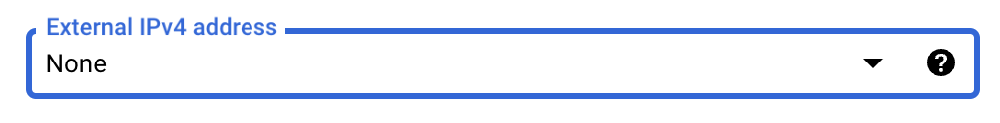

# Accessing GCP VMs (and relatedly, Jupyter notebooks) in a more secure way

### What's the problem?
- **SSH access**: When setting the externally accessible IP ranges on our GCP VMs, we specify which public IP addresses are allowed to _attempt_ to connect to the VM. Currently, we allow all public IPs to _attempt_ to connect. While SSH access requires both a valid SSH key and a Google account, allowing any public IP to attempt access increases the risk of brute-force attacks, where attackers try to guess your credentials.

- **Jupyter access**: If someone guesses your VM's external IP, port (`external_ip:8080`), and jupyter notebook password/token, they could potentially access your Jupyter server and its data.

### Options
To reduce risk, you have a few options:
- **(This tutorial) Encrypted tunnel for VM access and port forwarding**: Connect to the VM via an encrypted tunnel ([IAP tunneling](https://cloud.google.com/iap/docs/using-tcp-forwarding)) and forward the Jupyter server port to your local machine.
  - **Advantages**:
    - The VM is not exposed to the public internet; access is through Google's infrastructure only.
    - The Jupyter server is not directly accessible via the web. 
- **(Not covered here) Limit externally accessible IP ranges**: Restrict access to your VM by specifying trusted IP addresses (e.g., home network, office network). Only these IPs can attempt SSH access.
	- Note: This method does not protect the Jupyter server if someone guesses the VM's external IP, port, and Jupyter credentials.

### Steps:
1. Start a screen on your local machine, so that the ssh and port forwarding continues even if your terminal closed
	```bash
	screen -S port_forwarding
	```
1. SSH into the VM, adding flags for the tunnel and port forwarding:
   ```bash
   gcloud compute ssh --zone "us-central1-a" "{instance-name}" --project "{project-id}" --tunnel-through-iap -- -L 8080:localhost:8080
   ```

2. Follow the remaining [quickstart steps](../Introduction-to-GCP-VMs-and-using-Terra-notebook-environments.md#quickstart), same as usual:
	```bash
	screen
	
	sudo mount -o discard,defaults /dev/disk/by-id/{persistent-disk-name} /mnt/disks/{folder-name}
	
	sudo docker run -e R_LIBS='/home/jupyter/packages' --rm -it -u jupyter -p 8080:8080 -v /mnt/disks/{folder-name}:/home/jupyter --entrypoint /bin/bash {terra-docker-image-path}
	
	jupyter-lab --no-browser --port=8080
	
	```
3. Access the notebook:
    
    - Open your browser and go to `localhost:8080` instead of using the VM’s external IP.
2. If you want to close your terminal and keep the process running, detach from the screen
	```
	press CTRL + A
	press CTRL + D
	```
1. Remove the VM’s external IP address:
    
    - Navigate to **VM Instances** -> Select your VM -> Click **Edit** -> Go to **Network Interfaces** -> Click the dropdown next to **Default** -> Click the dropdown next to **External IPv4 Address** -> Select **None** and save changes.<br><br>
	   <br>
4. Remove the jupyter firewall rule:
    
    - Navigate to **VPC Network** -> **Firewall Policies** -> Delete any rule you created when following the documentation that allowed all source IP ranges and port 8080.<br><br>
	   <br>