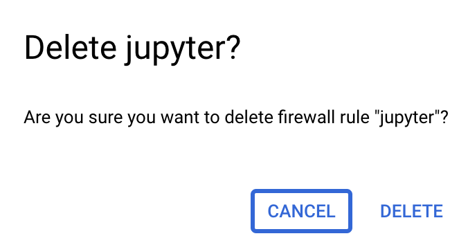

# Accessing Jupyter notebooks running in a GCP VM in a more secure way

### TL;DR
- If you set up your VM using the docs in this repository, [these are your new quickstart steps](#revised-quickstart).
- [Remove unsafe settings.](#unsafe-settings) 
### What's the problem?
- The way we access our Jupyter notebooks running in the VM is by navigating to the VM's associated external IP address and the port number (e.g. `external_ip:8080`). We created a firewall rule to allow access to this port. When setting up this firewall rule, we allowed _any public IP address_ can connect to `external_ip:8080`. **Allowing any public IP to access the port increases the risk of brute-force attacks, where attackers might try to guess your credentials (Jupyter notebook password or token).**
	- Note: Ports like 8080 and 5000 are commonly used for web applications, making it easier for someone to guess the port and potentially access the notebook.
### Options
To reduce risk, you have a few options:
- **(This tutorial) Do not associate an external IP with your VM**: Instead, connect to the VM via an encrypted tunnel ([IAP tunneling](https://cloud.google.com/iap/docs/using-tcp-forwarding)) and forward the Jupyter server port to your _local machine_.
  - **Advantages**:
    - The VM is not exposed to the public internet; access is through Google's infrastructure only.
    - The Jupyter server is not directly accessible via the web at all. 
- **(Not covered here) Limit externally accessible IP ranges**: If you do use an external IP, restrict access to your VM’s ports by specifying trusted IP addresses (e.g., home network, office network). Only these IPs will be able to access the port on which your notebook is running.
	- Create a firewall rule to do this. 

### Revised quickstart steps:<a name="revised-quickstart"></a>
If you set up this VM using the [Introduction-to-GCP-VMs-and-using-Terra-notebook-environments](../Introduction-to-GCP-VMs-and-using-Terra-notebook-environments.md) doc in this repository, these will be your new quickstart steps:
```bash
# start screen on local machine to keep port forwarding
screen -S port_forwarding

# SSH into VM, adding flags for IAP tunnel and port forwarding
gcloud compute ssh --zone "us-central1-a" \
"{instance-name}" \
--project "{project-id}" \
--tunnel-through-iap \
-- -L 8080:localhost:8080

# start screen on VM for your jupyter notebook process
screen -S jupyter_notebook

# mount persistent disk
sudo mount -o discard,defaults /dev/disk/by-id/{persistent-disk-name} /mnt/disks/{folder-name}

# start up terra notebook environment and jupyter notebook
sudo docker run -e R_LIBS='/home/jupyter/packages' --rm -it -u jupyter -p 8080:8080 -v /mnt/disks/{folder-name}:/home/jupyter --entrypoint /bin/bash {terra-docker-image-path}

jupyter-lab --no-browser --port=8080
```

#### Quickstart steps, explained:
1. Start a screen on your local machine so that the ssh and port forwarding continues even if your terminal closed
	```bash
	screen -S port_forwarding
	```
1. In the screen, SSH into the VM adding flags for the tunnel and port forwarding:
   ```bash
   gcloud compute ssh --zone "us-central1-a" \
   "{instance-name}" \
   --project "{project-id}" \
   --tunnel-through-iap \
   -- -L 8080:localhost:8080
   ```

2. If you set up this VM using the [Non-Terra GCP documentation](../Introduction-to-GCP-VMs-and-using-Terra-notebook-environments.md), we would follow the usual remaining [quickstart steps](../Introduction-to-GCP-VMs-and-using-Terra-notebook-environments.md#quickstart) to get your notebooks up and running:
	```bash
	# start screen on VM
	screen -S jupyter_notebook
	
	sudo mount -o discard,defaults /dev/disk/by-id/{persistent-disk-name} /mnt/disks/{folder-name}
	
	sudo docker run -e R_LIBS='/home/jupyter/packages' --rm -it -u jupyter -p 8080:8080 -v /mnt/disks/{folder-name}:/home/jupyter --entrypoint /bin/bash {terra-docker-image-path}
	
	jupyter-lab --no-browser --port=8080
	
	```
3. Access the notebook:
    
    - Open your browser and go to `localhost:8080`
2. Working with the screen
	- If you want to close your terminal and keep the process running, detach from the screen
		```
		press CTRL + A
		press CTRL + D
		```
	- If you want to get back into it
		```bash
		screen -r port_forwarding
		```


### Remove not safe settings<a name="unsafe-settings"></a>

1. Remove the VM’s external IP address:
    
    - Navigate to **VM Instances** -> Select your VM -> Click **Edit** -> Go to **Network Interfaces** -> Click the dropdown next to **Default** -> Click the dropdown next to **External IPv4 Address** -> Select **None** and save changes.<br><br>
	   <br>
4. Remove the firewall rule allowing anyone to access your VM's 8080 port:
    
    - Navigate to **VPC Network** -> **Firewall Policies** -> Delete any rule you created when following the documentation that allowed all source IP ranges to access port 8080.<br><br>
	   <br>


### When things go wrong
- **Suddenly, you can't load your notebook**<br><br>
	   <br>
	- This often means your ssh command (running in the `port_forwarding` screen) was interrupted, causing the forwarding of the VM's port 8080 to your local computer's port 8080 to stop. However, the Jupyter notebook process itself is still running. To resume access:
		```bash
		# on your local terminal, reconnect to screen where port forwarding command was run
		screen -r port_forwarding
		# if you see broken pipe or some other error, re-establish connection and port forwarding
		gcloud compute ssh --zone "us-central1-a" \
		"{instance-name}" \
		--project "{project-id}" \
		--tunnel-through-iap \
		-- -L 8080:localhost:8080
		# re-load localhost:8080 in browser, should be where you left off when connection broke
		```

- **Error: "Port already in use" when running the Docker or Jupyter command**:  
	- This happens when the port is still occupied by a process that wasn't fully shut down. Restarting the VM should resolve the issue.