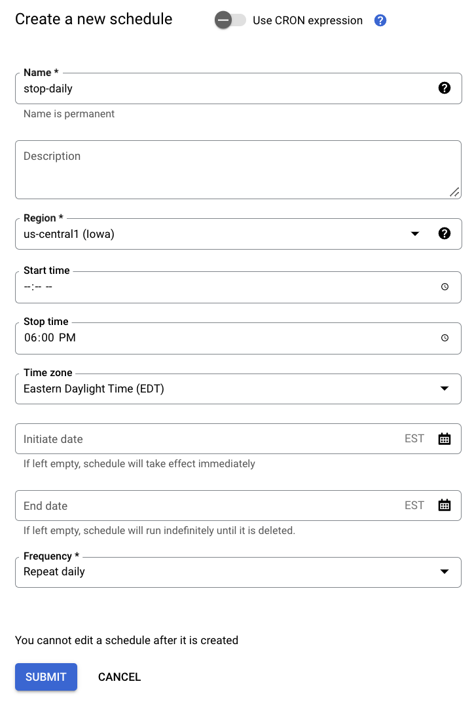
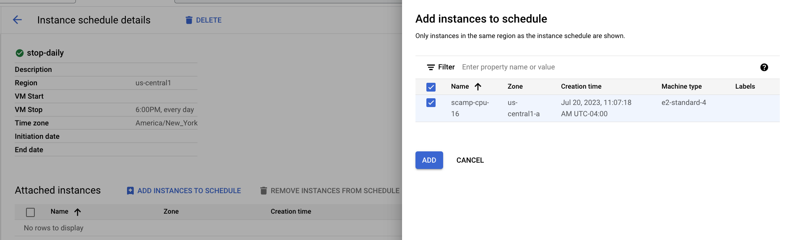

# Supplementary information

## Conda environment and kernels
By default, conda environments are placed in `/opt/conda/envs`. As I mentioned earlier, only files in `/home/jupyter` will be saved to the persistent disk, so by default the created conda environments **would be lost** if you created a new VM. 

To keep your conda environments, edit the conda configuration to save the environments to a location that is on the persistent disk. 
```bash
conda config --append envs_dirs /home/jupyter/envs
```

We can also use different conda environments within a Jupyter notebook using kernels. S/O Erica Pimenta for providing some insight into this. The main idea is that if you want to use a conda environment with a jupyter notebook, you need to have `ipykernel` installed in the environment. If you want the R kernel, you would need to have `r-irkernel` installed in the environment. For example, the below command would create an environment and associated python kernel for the `scanpy_env`. You could then use the `scanpy_env` python kernel and associated packages in a jupyter notebook.
```bash
conda create --name scanpy_env scanpy ipykernel
```

## Keep process on VM running when you shut computer/ lose wifi/ close terminal
To keep a process in the VM (e.g. a notebook session) running when you shut your computer/lose wifi connection/close terminal/etc, you need to use the `screen` function. 
```bash
# SSH into the VM if not already
gcloud compute ssh --zone "us-central1-a" "{instance-name}" --project "{project-id}"

# start screen
screen

# start process that you want to keep running regardless of connection
# example, a jupyter notebook
sudo docker run -e R_LIBS='/home/jupyter/packages' --rm -it -u jupyter -p 8080:8080 -v /mnt/disks/{folder-name}:/home/jupyter --entrypoint /bin/bash {terra-docker-image-path}

jupyter-lab --no-browser --port=8080

# disconnect from the screen and you should still be able to access notebook in browser
press CTRL + A
press CTRL + D

## other useful functions with screens
# list screens
screen -ls
# connect back to a screen
screen -r {screen-name}
# end all detatched screens
screen -ls | grep Detached | cut -d. -f1 | awk '{print $1}' | xargs kill

```

## [Persistent disk snapshot schedule](https://cloud.google.com/compute/docs/disks/scheduled-snapshots#:~:text=In%20the%20Name%20column%2C%20click,schedule%2C%20choose%20Create%20a%20schedule.)

Google cloud has a feature to regularly and automatically back up your persistent disks. You can create the snapshot schedule when you create the disk, or afterwards. 

At the moment, I don't think we have any guidelines here. I think it's best practice to select to autodelete snapshots after a certain amount of time to minimize storage costs. Also, perhaps a weekly snapshot is a good combination of frequency and storage and/or copy costs? 

## Instance schedule 
Terra had a nice feature of auto-pausing your VM when you weren't using it for >30 minutes. This feature allows us to reduce costs of VMs we forgot to shut off. 

This auto-pausing feature isn't the default GCP VM behavior, and I haven't yet found Terra's documentation on how they do this. 

However, google cloud does have what's called ["Instance schedules"](https://cloud.google.com/compute/docs/instances/schedule-instance-start-stop). Instance schedules allow you to program a start and/or stop time to a VM. Here, I am creating a schedule to stop my instance at 6PM daily in case I forget to shut it off myself.<br><br>
<br>

After creating the schedule, you can attach your VM to it. 

If you are getting a permissions error, you may need to edit the IAM permissions. Talk to Sabrina
## How the boot disk image used in this tutorial was created
<a name="boot"></a>
Steps to how I created the boot disk image `terra-docker-image-100-boot-20230720`
1. Install docker. 
   - The Terra notebook environments are [docker images](https://github.com/DataBiosphere/terra-docker). Therefore, in order to utilize these environments in our VM instances, we first have to install docker. I'm following [this](https://tomroth.com.au/gcp-docker/) tutorial which assumes a Debian Linux distribution, which is what GCP uses. 
	   ```bash
	   sudo apt update
	   sudo apt install --yes apt-transport-https ca-certificates curl gnupg2 software-properties-common
	   curl -fsSL https://download.docker.com/linux/debian/gpg | sudo apt-key add -
	   sudo add-apt-repository "deb [arch=amd64] https://download.docker.com/linux/debian $(lsb_release -cs) stable"
	   sudo apt update
	   sudo apt install --yes docker-ce
	   ```
2. Pull the following Terra dockers
	1. R/Bioconductor: us.gcr.io/broad-dsp-gcr-public/terra-jupyter-bioconductor:2.1.11
	2. Python: us.gcr.io/broad-dsp-gcr-public/terra-jupyter-python:1.0.15
	3. Default: us.gcr.io/broad-dsp-gcr-public/terra-jupyter-gatk:2.2.14


Erica has several workspaces. I think she could have one PD per workspace, and mount just mount the workspace PD she is interested in using that time/day/whatever. If she wanted to do things on each PD at once, she could create two VMs, ssh into both, mount each PD, and all should be good. 

## Sudo access on docker
- To be able to use the `sudo` command, you have to enter the docker as the root user. Generally wouldn't recommend accessing the docker as the root user because of file/folder permissions weirdness later. 
	```bash
	sudo docker run -e R_LIBS='/home/jupyter/packages' --rm -it -u root -p 8080:8080 -v /mnt/disks/{folder-name}:/home/jupyter --entrypoint /bin/bash {terra-docker-image-path}
	```
	
	```bash
	#example
	sudo docker run -e R_LIBS='/home/jupyter/packages' --rm -it -u root -p 8080:8080 -v /mnt/disks/scamp-singlecell:/home/jupyter --entrypoint /bin/bash us.gcr.io/broad-dsp-gcr-public/terra-jupyter-bioconductor:2.1.11
	```

## Known differences 
- cant access PROJECT, WORKSPACE, etc environment variables